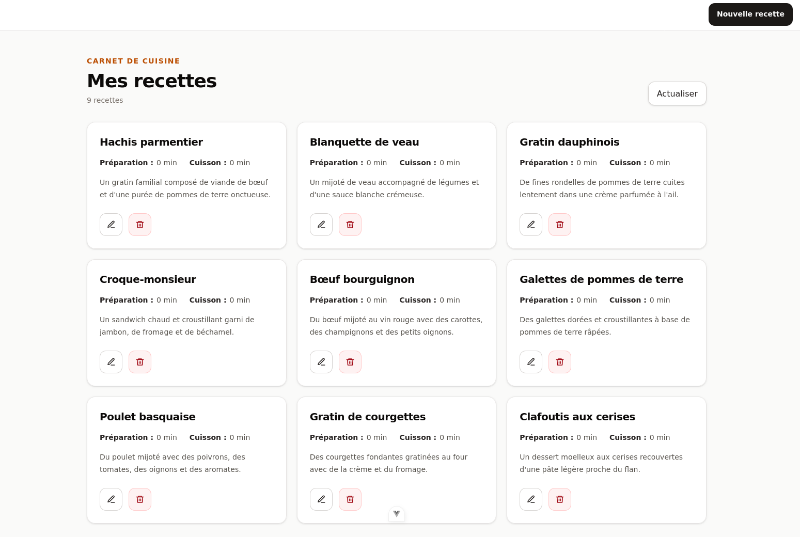

# Recipe Book — Symfony, API Platform et React

Recipe Book est une application web full-stack pédagogique de gestion de recettes, construite avec Symfony, API Platform, Doctrine ORM, SQLite et React. Elle permet de consulter, de créer, de modifier et de supprimer des recettes comprenant un nom, une description, un temps de préparation et un temps de cuisson.



## Objectifs d'apprentissage

Ce projet sert de support pour pratiquer :

- la création d'une API REST avec Symfony et API Platform ;
- la persistance et la validation des données avec Doctrine ORM et le Validator Symfony ;
- la description d'une API avec OpenAPI et Swagger ;
- la création d'une interface React avec des routes basées sur les fichiers ;
- la gestion des données distantes avec TanStack Query ;
- la construction de formulaires et la gestion des états de chargement et d'erreur ;
- l'intégration d'un frontend et d'une API grâce au proxy Vite et à CORS.

## Fonctionnalités

- affichage et actualisation de la collection de recettes ;
- ajout d'une recette ;
- modification d'une recette existante ;
- suppression d'une recette après confirmation ;
- validation du nom et des temps de préparation et de cuisson ;
- données de démonstration comprenant plusieurs recettes françaises ;
- documentation interactive de l'API avec Swagger.

## Architecture

Le projet est organisé en deux applications :

- `api/` : API REST basée sur Symfony 8.1, API Platform 4.3, Doctrine ORM et SQLite ;
- `frontend/` : interface React 19 basée sur TanStack Start, TanStack Router, TanStack Query, Vite et Tailwind CSS.

## Installation

### Prérequis

- PHP 8.4 ou supérieur ;
- Composer ;
- l'extension PHP SQLite ;
- Symfony CLI ;
- Node.js ;
- pnpm.

### Backend

Installer les dépendances de l'API :

```bash
cd api
composer install
```

Créer la base de données en appliquant les migrations :

```bash
php bin/console doctrine:migrations:migrate --no-interaction
```

Charger les recettes de démonstration :

```bash
php bin/console doctrine:fixtures:load --no-interaction
```

Cette commande remplace les données déjà présentes dans la base.

### Frontend

Installer les dépendances du frontend depuis la racine du projet :

```bash
cd frontend
pnpm install
```

## Démarrage

Dans un premier terminal, lancer l'API :

```bash
cd api
symfony server:start
```

Dans un second terminal, lancer le frontend :

```bash
cd frontend
pnpm dev
```

Les services sont alors disponibles aux adresses suivantes :

- application React : `http://localhost:3000/` ;
- documentation Swagger : `http://127.0.0.1:8000/api` ;
- collection JSON des recettes : `http://127.0.0.1:8000/api/recipes`.
